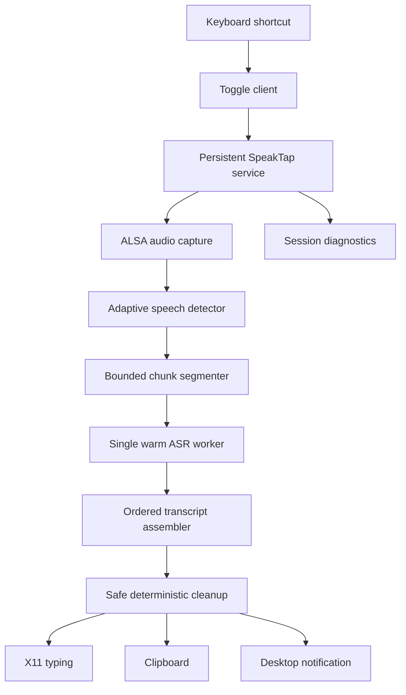
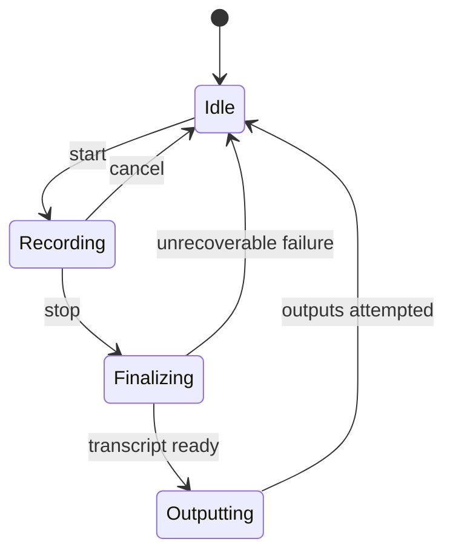

# SpeakTap architecture

SpeakTap is a local, CPU-first dictation pipeline. It separates Linux desktop
integration, audio capture, segmentation, ASR, transcript assembly, cleanup,
and output so each stage can evolve without leaking model-specific behavior
into the rest of the application.

## High-level pipeline



The client stays tiny and exits quickly. The service remains alive between
dictations so model loading and warm-up are not paid after every shortcut.

## Process model

SpeakTap uses two process roles:

- `speaktap`: sends toggle, start, stop, cancel, status, and service-stop
  commands over a private Unix socket;
- `speaktap-service`: owns the model, microphone process, session state, worker
  threads, output adapters, and diagnostics.

The client starts the service automatically when needed. The service accepts
one active recording session at a time and one ASR inference request at a time.

## Session lifecycle



Every session receives an immutable ID and pins the selected model profile.
Changing the installed profile requires stopping and reinstalling the service;
there is no hot model switching.

## Audio capture

`LinuxArecordSource` launches `arecord` with an argument array, never through a
shell:

```text
16 kHz
mono
signed 16-bit little-endian PCM
20 ms frames
```

Capture and inference run on separate threads. The capture thread continues
while completed chunks are transcribed.

## Speech activity and segmentation

The current detector is adaptive signal-energy logic with:

- a conservative absolute speech floor;
- a slowly adapting noise estimate;
- separate speech-on and speech-off thresholds;
- hysteresis to avoid rapid toggling;
- speech-edge padding so quiet consonants are not clipped.

The detector marks frames; it does not concatenate isolated speech regions.
The segmenter uses those marks to close chunks at natural pauses.

Chunk rules have three bounds:

1. before the minimum duration, keep collecting audio;
2. after the target duration, accept a shorter natural pause;
3. at the hard maximum, force a cut and retain overlap for assembly.

Defaults:

```text
minimum chunk       4 s
target chunk       15 s
maximum chunk      25 s
silence boundary  600 ms
forced overlap    400 ms
```

## ASR contract

The pipeline depends on an architecture-neutral `AsrBackend`:

```text
load()
warmup()
transcribe(audio_chunk, sample_rate, language) -> AsrResult
capabilities() -> AsrCapabilities
close()
```

Model adapters own tensor names, graph splits, preprocessing, decoding, caches,
tokenization, and language behavior. The pipeline only receives text and
diagnostics.

`AsrCapabilities` records:

```text
required_sample_rate
preferred_chunk_seconds
max_chunk_seconds
supports_word_timestamps
supports_language_hint
max_concurrency
```

SpeakTap currently uses the `onnx-asr` adapter and ONNX Runtime CPU execution.
Every model profile pins:

- architecture adapter;
- Hugging Face repository;
- immutable repository commit;
- exact downloaded files;
- quantization;
- supported language behavior;
- chunk constraints;
- expected memory;
- admission status.

## Supported model architectures

| Architecture | Runtime status | Notes |
| --- | --- | --- |
| TDT transducer | Supported | Default Parakeet profile |
| RNN-T transducer | Adapter available | No admitted SpeakTap profile |
| CTC encoder-only | Adapter available | No admitted SpeakTap profile |
| Attention encoder-decoder | Benchmark candidate | Canary and Whisper require explicit admission |
| Stateful streaming ASR | Planned | Needs state carry and final flush |
| Hybrid/ensemble ASR | Unsupported | Outside the single-model service |
| Hosted ASR API | Unsupported | SpeakTap is local-first |
| Non-ONNX learned model | Unsupported | Learned inference stays on ONNX Runtime |

The architecture family alone does not imply support. A profile is admitted
only after its exact artifacts pass compatibility, accuracy, latency, memory,
long-input, and license checks.

## Scheduling and backpressure

Finalized chunks receive monotonically increasing sequence numbers and enter a
bounded queue. One worker consumes them in order.

Running multiple CPU inferences concurrently is intentionally disabled. ONNX
Runtime already uses native worker threads; parallel requests usually compete
for the same cores and memory bandwidth.

If ASR falls behind:

- microphone capture continues;
- finalized chunks remain queued;
- stopping waits for the remaining chunks;
- diagnostics expose queue wait and inference time;
- no frame or transcript chunk is silently reordered.

## Transcript assembly

The assembler sorts successful chunks by sequence.

- Silence-cut chunks join with whitespace.
- Forced-cut chunks use suffix/prefix word matching to remove overlap
  duplication.
- Failed chunks remain visible in session diagnostics.
- Assembly never paraphrases text.

Each transcript chunk retains:

```text
session_id
sequence
audio_start_ms
audio_end_ms
cut_reason
overlap_ms
raw_text
queue_wait_ms
asr_duration_ms
error
```

## Cleanup

Cleanup runs once after complete transcript assembly.

`SafeCleaner` removes only:

- explicit hesitation sounds;
- immediately repeated words or short phrases.

It does not resolve self-corrections, change terminology, answer questions,
execute commands, or invent punctuation. `NoopCleaner` provides exact raw-text
output.

Any future learned cleaner must:

1. preserve meaning, names, numbers, URLs, paths, commands, and identifiers;
2. support the declared languages with measured per-language evidence;
3. never answer or act on dictated content;
4. beat deterministic cleanup;
5. run inside the post-stop CPU budget;
6. use pinned ONNX artifacts with a distributable license;
7. fall back to the assembled raw transcript on any failure.

The evaluated learned candidates did not meet this bar. See
[cleanup-model research](cleanup-model-research.md).

## X11 desktop integration

SpeakTap currently supports X11:

- `xdotool` types into the focused window;
- `xclip` updates the clipboard;
- `notify-send` emits transient notifications;
- `paplay` plays start and stop sounds.

Each output is best effort. A notification or typing failure must not discard a
successful transcript. Wayland output is planned but is not currently claimed
or auto-detected.

## Runtime data

```text
$XDG_RUNTIME_DIR/speaktap/
├── service.sock
├── service.lock
└── service.log

$XDG_CONFIG_HOME/speaktap/
└── config.json

$XDG_STATE_HOME/speaktap/
└── sessions.jsonl
```

Fallbacks are `~/.config/speaktap`, `~/.local/state/speaktap`, and a
UID-specific private runtime directory when the XDG runtime directory is
unavailable. Runtime directories are ownership-checked, reject symlinks, and
use mode `0700`.

Model artifacts use the Hugging Face cache and are resolved by immutable commit
revision.

## Failure policy

SpeakTap degrades toward the simplest usable result:

1. cleanup succeeds → emit cleaned text;
2. cleanup fails → emit assembled raw text;
3. one chunk fails → preserve successful chunks and report the failure;
4. typing fails → clipboard remains available;
5. notification or sound fails → transcription continues;
6. service failure → runtime logs remain available for diagnosis.

No optional stage may turn a valid raw transcript into a lost transcription.

## Observability

Each session records:

- model profile and immutable revision;
- recording and detected-speech duration;
- chunk boundaries and cut reasons;
- queue wait and ASR time per chunk;
- assembly and cleanup duration;
- post-stop latency;
- output errors;
- final session status.

Benchmark results remain outside Git because they may contain raw audio and
transcripts. Release evidence uses public datasets; personal microphone
recordings are optional local diagnostics.
